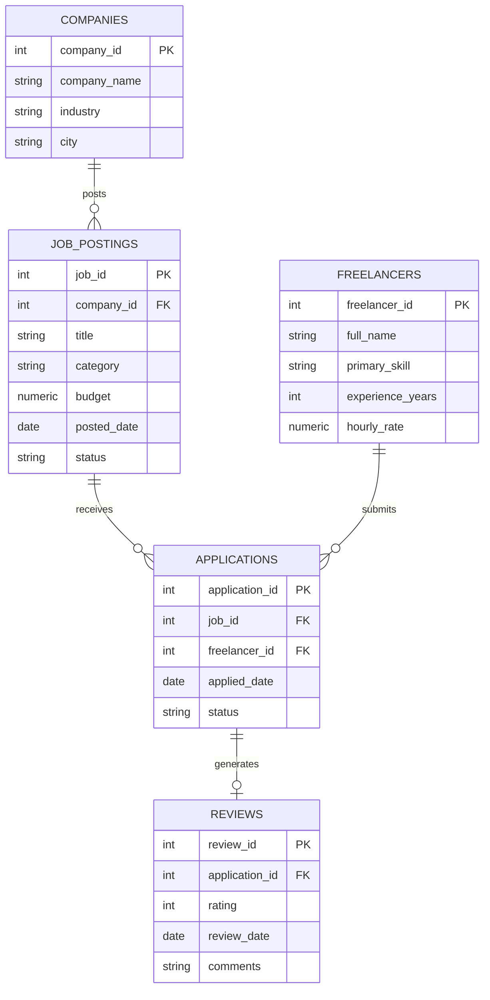

# GigConnect
### A Freelance Marketplace Database — Built and Queried Entirely in PostgreSQL

Every freelance platform — Upwork, Fiverr, Toptal — runs on the same underlying
pattern: companies post work, freelancers apply, some get hired, fewer get reviewed.
This project models that lifecycle as a normalized relational schema, then answers
real marketplace questions against it using pure SQL.

---

## The Lifecycle This Models


Each stage of that funnel maps directly onto a table. The database isn't just storing
records — the relationships between the tables encode the actual business process.

---

## Schema



**`applications` is the table that does the real work.** It isn't just a bridge
between freelancers and jobs — it carries its own status
(`APPLIED` → `SHORTLISTED` → `HIRED`/`REJECTED`), so the data itself reflects who
almost got the gig and who actually did.

Constraints worth noting:
- `CHECK` constraints restrict every status column to a fixed set of valid values
- `applications` has a `UNIQUE (job_id, freelancer_id)` constraint — no duplicate applications
- `reviews.application_id` is `UNIQUE` — one review per completed contract
- Every foreign key column is indexed, since every query here joins on one

---

## Files

| File | Purpose |
|---|---|
| `01_schema.sql` | Creates all 5 tables, foreign keys, `CHECK` constraints, and indexes |
| `02_seed_data.sql` | Populates the schema — 12 companies, 45 freelancers, 40 jobs, 150 applications, ~20 reviews, all generated in SQL (no CSV imports) |
| `03_queries.sql` | 14 queries answering real marketplace questions |

**Design note:** seed dates are anchored to `CURRENT_DATE` rather than a hardcoded
calendar date. That means the "open jobs" and "days to first application" queries
stay correct no matter when the script is actually run.

---

## Running It

```bash
createdb gigconnect

psql -d gigconnect -f 01_schema.sql
psql -d gigconnect -f 02_seed_data.sql
psql -d gigconnect -f 03_queries.sql
```

Each script prints a row-count sanity check so you can confirm the load worked
before moving to the next step.

---

## What the Queries Answer

- Which jobs are open right now, and who posted them?
- Which skill category receives the most applications?
- Which freelancers convert applications into hires most often (hire rate, not just volume)?
- Which companies pay the highest average budget, and does that vary by industry?
- Which freelancers are registered but have never applied to a job?
- Who are the top-rated freelancers, and how does that relate to their rate?
- On average, how long after a job is posted does it get its first application?

Full list in `03_queries.sql` — the techniques used include joins across multiple
tables, `GROUP BY`/`HAVING`, `CASE WHEN` funnel labeling, subqueries, and conditional
aggregation with `COUNT(*) FILTER (WHERE ...)`.

---

## What I'd Add Next

- A separate `contracts` table to distinguish "hired" from "work actually completed"
- A trigger to auto-close a job posting once it receives a `HIRED` application
- Window functions — ranking freelancers within their skill category by hire rate,
  running totals of monthly job postings
- `EXPLAIN ANALYZE` benchmarks once the dataset is scaled up enough for indexing
  choices to matter

---

## Tech
PostgreSQL · Pure SQL, no ORM
